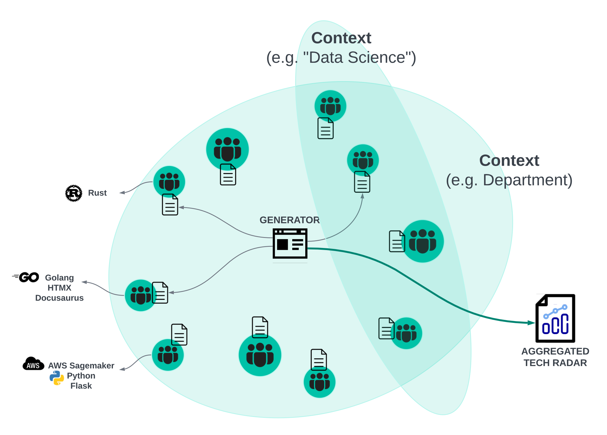

# Decentralized Tech Radar
IT University of Copenhagen, ISE 2024 Collaboration

> IMPORTANT: This repository is meant to house a toolstack for generating a tech radar from configuration/specification files. It will _NOT_ be containing a company specific tech radar.

## Concept
> More explanatory details to come

